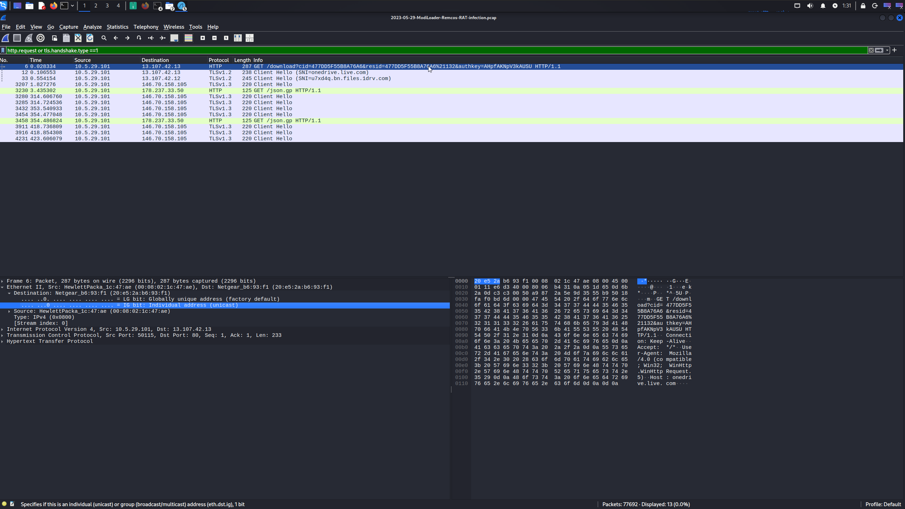
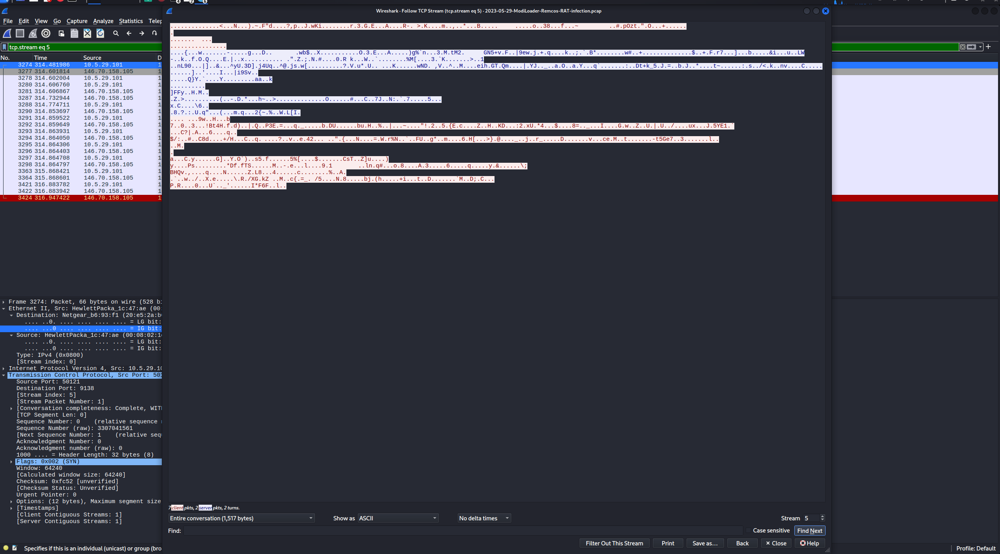
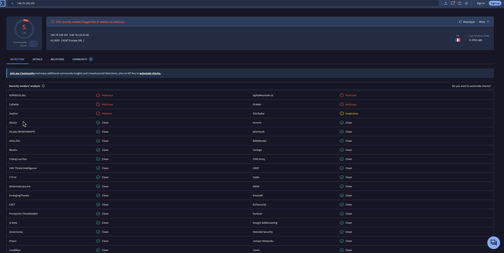

# 🛡️ Malware Traffic Analysis: Remcos RAT Case Study

## 📑 نبذة عن المشروع
تحليل جنائي رقمي لحركة شبكة مشبوهة (Network Forensic Analysis) تتبع دورة حياة هجوم برمجية **Remcos RAT**. يهدف هذا المشروع إلى استعراض مهارات استخدام أدوات التحليل وربط الأدلة لتحديد مؤشرات الاختراق (IOCs).

---

## 🛠️ تفاصيل بيئة التحقيق
* **الأداة المستخدمة:** Wireshark
* **نظام التحليل:** Kali Linux
* **مصدر الحالة:** Malware-Traffic-Analysis.net

---

## 🔍 التسلسل الزمني والتحليل الفني (Investigation Steps)

### 1️⃣ تحديد الضحية ونقطة الدخول (Initial Access)
تم البدء بتعقب أول اتصال مشبوه صادر من الشبكة الداخلية.
* **الضحية (Victim):** `10.5.29.101`
* **الملاحظات:** تم رصد استعلام DNS متبوعاً بطلب `HTTP GET` لموقع **OneDrive**. المهاجم استخدم منصة موثوقة لتجاوز الأنظمة الدفاعية وتسهيل عملية تحميل الحمولة الخبيثة.

### 2️⃣ تشريح الحزمة وتحليل الروابط (Packet Inspection)
بالغوص في تفاصيل البروتوكول، تم استخراج الرابط المباشر المستخدم لجلب الملف الخبيث.
* **الرابط:** يظهر استخدام مفاتيح برمجية مثل `authkey` داخل الرابط، وهي تقنية تستخدم لضمان وصول الضحية المستهدفة فقط للحمولة (Payload).

### 3️⃣ استعادة الأدلة الرقمية (Artifact Recovery)
استخراج الملفات المتبادلة (Objects) كشف عن تحركات البرمجية فور استقرارها في جهاز الضحية.
* **الاكتشاف:** رصد تواصل تلقائي مع `geoplugin.net`. تستخدم البرمجيات الخبيثة هذا الموقع لتحديد الموقع الجغرافي للضحية (Geo-location) لإبلاغ لوحة تحكم المهاجم ببيانات الضحية الجغرافية.

### 4️⃣ كشف سيرفر التحكم (C2 Beaconing)
تعتبر هذه المرحلة الأهم لتحديد مركز إدارة الهجوم.
* **سيرفر المهاجم (C2):** `146.70.158.105`
* **المنفذ (Port):** `9138` (منفذ غير قياسي).
* **التحليل:** استخدام فلتر `tcp.flags.syn == 1` كشف عن نشاط "المناداة" (Beaconing)، وهي محاولات اتصال متكررة تثبت وجود برمجية RAT تحاول البقاء على اتصال دائم بالمخترق.

### 5️⃣ تحليل تدفق البيانات (Encrypted Exfiltration)
تحليل الـ TCP Stream لفهم طبيعة البيانات المتبادلة.
* **النتائج:** التواصل مشفر بالكامل وغير مفهوم للنص العادي. يهدف هذا السلوك لتجنب كشف الأوامر التخريبية (مثل سحب الملفات أو التجسس) من قبل أنظمة مراقبة الشبكة.

### 6️⃣ التحقق الاستخباراتي (Threat Intelligence)
تأكيد النتائج المخبرية عبر ربطها بمصادر استخبارات التهديدات العالمية.
* **المرجع:** VirusTotal.
* **النتيجة:** تصنيف قاطع للعنوان `146.70.158.105` كعنوان خبيث (Malicious) ومرتبط ببنية تحتية لمهاجمين.

---

## 📊 ملخص مؤشرات الاختراق (IOCs)

| نوع المؤشر | القيمة | الوصف |
| :--- | :--- | :--- |
| **Victim IP** | `10.5.29.101` | الجهاز المصاب داخل الشبكة |
| **C2 Server** | `146.70.158.105` | سيرفر التحكم والمسيطرة (فرنسا) |
| **Dest Port** | `9138` | المنفذ المستخدم للتحكم عن بعد |
| **Malware Family**| `Remcos RAT` | نوع طروادة التحكم المكتشفة |

---

## 💡 التوصيات الأمنية (SOC Recommendations)
1. حظر العنوان `146.70.158.105` والمنفذ `9138` فوراً في الجدار الناري.
2. عزل الجهاز المصاب عن الشبكة وإجراء مسح شامل (Forensic Scan).
3. تحديث قواعد بيانات الـ IDS لرصد أنماط Beaconing المشابهة لبرمجية Remcos.

---
*مشروع تحليل أمني - مسار محلل SOC*
