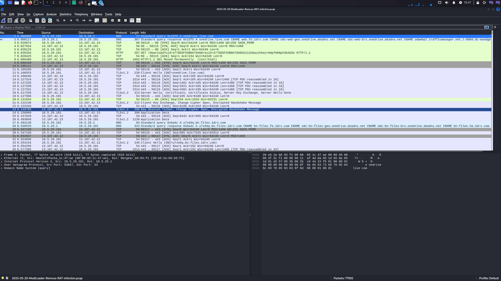
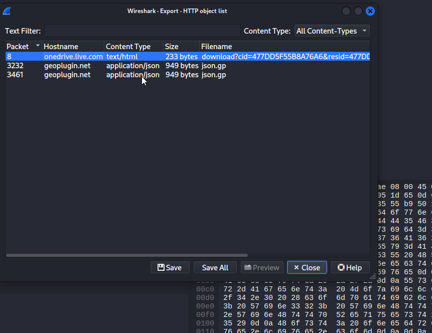
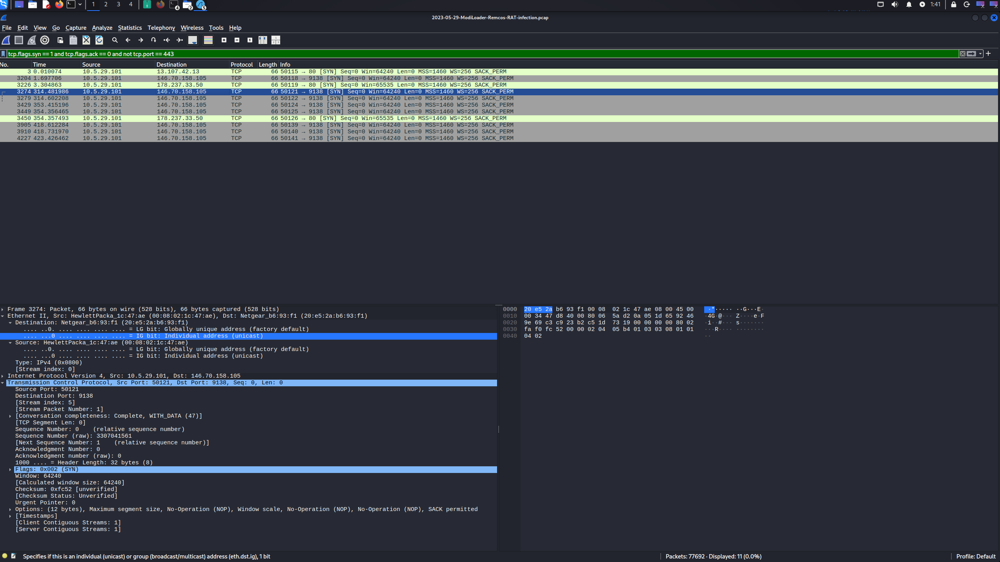

# Malware Traffic Analysis: Remcos RAT Case Study

## نبذة عن المشروع
تحليل جنائي رقمي لحركة شبكة مشبوهة (Network Forensic Analysis) تتبع دورة حياة هجوم برمجية **Remcos RAT**. يهدف هذا المشروع إلى استعراض مهارات استخدام أدوات التحليل وربط الأدلة لتحديد مؤشرات الاختراق (IOCs).

---

##  تفاصيل بيئة التحقيق
* **الأداة المستخدمة:** Wireshark
* **نظام التحليل:** Kali Linux
* **المصادر:** Malware-Traffic-Analysis.net & Threat Intelligence (VirusTotal)

---

## التسلسل الزمني والتحليل الفني (Investigation Steps)

### 1️⃣ تحديد الضحية ونقطة الدخول (Initial Access)
تم البدء بتعقب أول اتصال مشبوه صادر من الشبكة الداخلية.
* **الضحية (Victim):** `10.5.29.101`
* **الملاحظات:** تم رصد استعلام DNS متبوعاً بطلب `HTTP GET` لموقع **OneDrive** لتحميل الحمولة الخبيثة.

### 2️⃣ استعادة الأدلة الرقمية (Artifact Recovery)
استخراج الملفات المتبادلة كشف عن تواصل تلقائي مع `geoplugin.net` لتحديد الموقع الجغرافي للضحية (Geo-location).

### 3️⃣ كشف سيرفر التحكم (C2 Beaconing)
تعتبر هذه المرحلة الأهم لتحديد مركز إدارة الهجوم.
* **سيرفر المهاجم (C2):** `146.70.158.105` عبر المنفذ `9138`.
* **التحليل:** رصد نشاط "المناداة" (Beaconing) المتكرر، مما يثبت وجود اتصال دائم بالمخترق.

---

## النتائج الرئيسية (Key Findings)
* **تقنية التمويه:** استخدام منصات موثوقة (OneDrive) لتجاوز أنظمة الدفاع.
* **ثبات الاتصال:** محاولات اتصال متكررة وغير مشفرة في البداية ثم التحول لاتصال مشفر عبر منفذ غير قياسي.

## مؤشرات الاختراق المستخرجة (Captured IOCs)

| النوع (Type) | القيمة (Value) | الوصف (Description) |
| :--- | :--- | :--- |
| **Victim IP** | `10.5.29.101` | الجهاز المصاب داخل الشبكة |
| **C2 Server** | `146.70.158.105` | سيرفر التحكم والمسيطرة (فرنسا) |
| **Dest Port** | `9138` | المنفذ المستخدم للتحكم عن بعد |
| **Malware Family**| `Remcos RAT` | نوع طروادة التحكم المكتشفة |
| **PCAP Pass** | `infected` | كلمة مرور ملف الـ ZIP المرفق |

---

##  مسار الهجوم (Attack Lifecycle)
بناءً على التحليل، اتبع الهجوم مراحل **Cyber Kill Chain**:
1. **Delivery:** عبر رابط OneDrive ملغم.
2. **Exploitation:** تحميل وتشغيل ملف برمجية Remcos RAT.
3. **C2 Communication:** إنشاء اتصال مستمر (Beaconing) مع السيرفر الخارجي.

---

## التوصيات الأمنية (SOC Recommendations)
1. حظر العنوان `146.70.158.105` والمنفذ `9138` في الجدار الناري فوراً.
2. عزل الجهاز المصاب وإجراء مسح شامل (Forensic Scan).
3. تحديث قواعد بيانات الـ IDS لرصد أنماط Beaconing المشابهة.

---

##  محتويات المستودع
* `screenshots/`: لقطات شاشة لخطوات التحليل.
* `pcap_files/`: يحتوي على ملف الـ PCAP الأصلي (مضغوط بكلمة مرور `infected`).
* `README.md`: التقرير التحليلي النهائي.

---
*طالبة أمن سيبراني | مسار محلل SOC*
